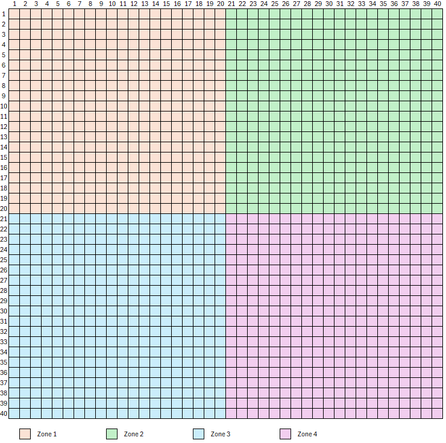

# 1. La galaxie, les systèmes et les planètes

## 1.1 La galaxie

La galaxie se nomme Dune. Elle est formée de systèmes stellaires, eux-mêmes constitués de planètes habitables. Actuellement divisée en quatre secteurs comprenant chacun 40 systèmes, elle compte de 10 à 20 planètes par système.

La galaxie est un tore quadrillé, initialement de 40x40 cases (appelées aussi *parsecs*) de côté. Les bords opposés sont contigus. On passe donc de la case (parsec) 40-40 à la case (parsec) 40-1 comme si elles étaient adjacentes.

Une case ne peut contenir qu’un seul système.

***Important*** : l’axe X/Y est inversée. X représente l’axe vertical, Y l’axe horizontal

## 1.2 Les systèmes

Un système est composé d'une étoile centrale autour de laquelle gravitent plusieurs planètes habitables.

L'un des systèmes de votre domaine fait office de capitale. Vous pouvez toutefois en désigner un autre à chaque tour.

L'emplacement de votre capitale influe directement sur la stabilité de votre domaine (Voir [1.3](#1.3)).

### 1.2.1 Généralités

Un système possède :

- Un nom

- Des coordonnées

- Un type d’étoile

- Un nombre de planètes

Certains systèmes possèdent des ressources rares et impossibles à produire dont la découverte est directement signalée par le jeu dans les événements publics.

Hormis ceux des commandants, tous les systèmes de la galaxie sont neutres et ne sont contrôlés par aucun joueur.

Pour renommer un système, le commandant must en posséder toutes les planètes.

Les coordonnées du système sont composées d’une paire XX-YY dont chaque composante peut varier de 1 à 40.

*Exemple : Le système ayant pour nom Terre d'asile a pour coordonnées 1-33 : 1 selon l'axe vertical et 33 selon l'axe horizontal.*

Chaque système possède une étoile, autour de laquelle orbitent des planètes. On distingue 6 types d’étoile différents :

- Etoile bleue

- Nova

- Etoile blanche

- Naine orange

- Naine bleue

- Naine rouge

Les étoiles bleues possèdent en moyenne plus de planètes que les novas, qui en comptent elles-mêmes davantage que les étoiles blanches, et ainsi de suite. Le nombre de planètes dans chaque système is compris entre 10 et 20. Un système peut être partagé entre autant de commandants qu'il compte de planètes.

*Exemple : Le système ayant pour nom Terre d'asile possède 10 planètes. Le commandant X en possède deux, le commandant Y une, le commandant Z trois. Les quatre planètes restantes sont neutres. Ce système est donc partagé entre quatre propriétaires.*

### 1.2.2 Les planètes

Chaque planète porte un nom; par défaut, elle porte le nom de son système suivi d’un numéro attribué de la plus proche de son étoile à la plus éloignée.

Les planètes possèdent les caractéristiques suivantes :

- Taille

- Atmosphère

- Type

- Habitabilité de la planète

- Valeur liée à la production minière

- Encombrement

- Capacité de construction

- Production de marchandises

La taille d'une planète varie de 1 à 6.

Le type d'une planète est indiqué par la vignette située en haut à gauche de sa fiche descriptive. Cette valeur varie de 1 à 20.

Chaque planète possède un type d’atmosphère, et des valeurs de radiation, température et gravité. En début de partie, certaines planètes sont totalement inhabitables, tandis que d’autres ne le sont que pour certaines espèces.

L’encombrement correspond à la somme des points de construction des bâtiments érigés sur la planète. Son seuil maximal représente la limite absolue au-delà de laquelle aucun nouveau bâtiment ne peut être construit.

Chaque planète octroie un point de construction au système auquel elle appartient.

Une planète peut produire naturellement une ou plusieurs marchandises.

Le nombre de planètes dans chaque système varie de 10 à 20. Un système peut être partagé entre autant de propriétaires qu’il compte de planètes.

*Exemple : Le système ayant pour nom Terre d'asile possède 10 planètes. Le commandant X en possède deux, le commandant Y une, le commandant Z trois. Les planètes restantes sont neutres. Ce système est donc partagé entre 4 propriétaires (X, Y, Z et neutre).*

### 1.2.3 Population

La population d’un système is la somme des populations de ses planètes. Elle est exprimée en millions d'habitants.

*Exemple : Dans son rapport sur le système "Terre d'asile", le commandant X ne verra dans cette rubrique que le total de la population des deux planètes qui lui appartiennent. Une population de 10, signifie que 10 millions d'habitants y sont répertoriés. Les autres planètes du système sont peut-être peuplées, mais cela n'est pas indiqué ici.*

Une planète ne peut contenir qu’un seul type de population. Par défaut, il s’agit de la population optimale, mais il est possible de la changer au moyen de vaisseaux colonisateurs.

(Plus d’informations au [2](2_population.md).)

### 1.2.4 Minerai

Les revenus en minerai d'un système correspondent à la somme de ceux générés par ses planètes.

Chaque planète possède une capacité de production minière dont la valeur est comprise entre 1 et 8 (voir [3.1](3_constructions.md#3.1)).

Dans le cas d'un système partagé, seuls sont pris en compte les revenus des planètes appartenant au commandant. Il en va de même pour les stocks.

### 1.2.5 Terraformation

Le niveau de terraformation d'un système correspond à la moyenne de celui de ses planètes (la règle du système partagé s'applique également).

Plus d’informations sur le sujet au [2.1.1](2_population.md#2.1.1).

### 1.2.6 Politique

La politique d’un système planétaire est une directive globale de gestion fixée par un commandant, qui s'applique à l'ensemble des planètes qu'il possède au sein de ce système.

Elle permet d'orienter les priorités stratégiques du système en appliquant des modificateurs spécifiques (bonus et/ou malus) sur des indicateurs clés tels que les revenus fiscaux, la stabilité, la production industrielle, le rendement commercial, la croissance démographique ou la réputation du joueur.

Il existe plusieurs formes de politique possibles :

- **0. Loisir** : les revenus des impôts de chaque planète du système sont diminués de 5%. La stabilité du système augmente de 2% par tour. Le commandant gagne un nombre de points de réputation par tour égal au double du nombre de planètes.

- **1. Impôts** : les revenus des impôts de chaque planète du système sont augmentés de 10%

- **2. Commerce** : le système produit 2 unités en plus pour les marchandises qui possèdent déjà une production sur le système dans le poste commerciales du système

- **3. Construction** : le nombre de points de construction du système est augmenté de 50% (arrondis à l'entier inférieur).

- **4. Défense** : La mobilisation des milices planétaires lors des combats est augmenté de 50%. Cette politique est utile pour les systèmes ayant une stabilité faible, mais sans intérêt pour les systèmes avec une forte stabilité car ils se défendent déjà au maximum de leurs possibilités.

- **5. Expansion** : La population augmente dans toutes les planètes 5% plus vite.

- **6. Intégriste** : La population augmente dans toutes les planètes 10% plus vite. Le commandant perd un nombre de points de réputation par tour égal au nombre de planètes du système. La stabilité du système diminue de 2% par tour.

- **7. Totalitaire** : Le système a un bonus de stabilité de 2% par tour. Le commandant perd un nombre de points de réputation par tour égal au nombre de planètes du système. La production du poste commercial baisse d'une unité par type de produit (production minimum 0).

- **8. Esclavagiste** : Le nombre de points de construction du système est multiplié par deux. La stabilité du système diminue de 2% par tour. Le commandant perd un nombre de points de réputation par tour égal au double du nombre de planètes du système. La population ne peut pas augmenter de plus de 10 millions par tours.

- **9. Anti-Fremen** : Le nombre de Fremens sur les différentes planètes du système est divisé par deux. Si la population fremen sur une planète est inférieure à 30, la population fremen est éradiquée : sa population maximale est réduite à 0, et il faudra éventuellement attendre qu'un colonisateur recolonise cette planète pour que des Fremens puissent de nouveau s'y installer. Cette politique rapporte en centaures un nombre égal à la population diminuée. Le système a un malus de stabilité de 5% par tour. Le commandant perd 300 points de réputation par tour.

- **10 et suivantes ...** Des politiques similaires à la politique anti-Fremen sont disponibles concernant les autres espèces.

Une politique n'est jamais définitive et peut être modifiée à tout moment. Toutefois, tout changement de politique au sein d'un système coûte 10 centaures, représentant les frais de réorganisation.

### 1.2.7 Taux de taxation

Le taux de taxation est un paramètre fixé par le commandant pour déterminer le niveau de prélèvement fiscal en Centaures sur ses populations, que ce soit à l'échelle d'un système entier ou d'une planète individuelle.

Ce taux correspond à la moyenne de celui de ses planètes (la règle du système partagé s'applique également). Au fil de vos découvertes technologiques, il vous sera possible de définir le taux de taxation par planète.

Il peut également influer sur la stabilité du système ou de la planète (voir [1.3.2](#1.3.2)*).*

## 1.3 Le taux de stabilité

Le taux de stabilité est un indicateur exprimé en pourcentage qui mesure l'allégeance, l'ordre et le niveau de loyauté de la population d'une planète ou d'un système envers son commandant.

À l'échelle d'un système, la stabilité affichée correspond à la moyenne de la stabilité de ses planètes.

Exprimé en pourcentage, le taux de stabilité est réévalué à chaque tour. Plus il est bas, plus le risque de révolte augmente et plus les défenses de la planète sont affaiblies (voir [5.3.4](5_combats.md#5.3.4)).

Par exemple, un système présentant une stabilité de 80 % ne pourra se défendre, en cas d'attaque, qu'à 80 % de ses capacités. Enfin, si la planète est en révolte, son coefficient de défense est à nouveau divisé par 2.

L’éloignement d’un système par rapport à la capitale influe sur sa stabilité.

|            |               |
|------------|---------------|
| 0          | +3% par tour  |
| 1 ou 2     | +2% par tour  |
| 3 ou 4     | +1% par tour  |
| 5          | 0             |
| 6          | -1% par tour  |
| 7          | -3% par tour  |
| 8 ou 9     | -6% par tour  |
| 10         | -9% par tour  |
| 11 ou plus | -16% par tour |

*\* Il est important de noter que les distances sont calculées en nombre entier de parsecs, une diagonale ne compte que pour 1. Par exemple, un système en 40-40 est à 3 parsecs d'une capitale en 38-37 et sa stabilité sera affectée d'un bonus de 1%.*

Outre l'éloignement par rapport à la capitale et le taux de taxation, il existe d'autres facteurs influant la stabilité, tels que la politique (voir [1.2.6](#1.2.6)), la présence d'un gouverneur (voir [8.2](8_lieutenants.md#8.2)) et de grandes quantités de certaines marchandises (voir [3.2](3_constructions.md#3.2)).

En cas d'absence de capitale, une pénalité de distance maximale s'applique à la stabilité de chaque système au tour suivant.

**L’opinion entre espèces, disponible dans les Statistiques Univers, est purement rôle play **et dépend des actions menées par les commandants d'une espèce envers ceux d'une espèce différente : ils sont en effet considérés par leurs semblables comme leurs plus éminents représentants. Les relations entre commandants et systèmes neutres ne sont quant à elles pas concernées.

En voici le détail :

|                                                   |                                                          |
|---------------------------------------------------|----------------------------------------------------------|
| Attaque d'une planète en mode "éradication"       | -200                                                     |
| Attaque d'une planète en mode "pillage"           | -50                                                      |
| Attaque d'une planète                             | -20                                                      |
| Combat Flotte-Flotte                              | -2 x le niveau de puissance des deux flottes (de 0 à 10) |
| Don de centaures à un autre commandant            | +(don / 200)                                             |
| Transfert d'une technologie à un autre commandant | +50                                                      |
| Transfert d'une flotte à un autre commandant      | +2 x le niveau de puissance de la flotte (de 0 à 10)     |
| Transfert d'un système à un autre commandant      | +10                                                      |

Lors d'un combat, les relations sont affectées dans le secteur où se situe la case de l'affrontement. En cas de don, c'est le secteur de la capitale du bénéficiaire qui voit ses relations interespèces s'améliorer.

### 1.3.1 État de révolte ou de paix

La révolte d’une planète est un état d'insurrection de sa population provoqué par un niveau de stabilité insuffisant.

Chaque planète effectue un test de révolte à chaque tour.

*Exemple : Une planète ayant une stabilité de 80%, à un tour donné, a 20% de risque d'entrer en révolte : (100% - 80%)*

La formule exacte concernant le pourcentage de risque d'avoir au moins une planète en révolte par système est : 1 - stab^(nbre de planètes).

*Exemple : si j'ai 99% de stabilité sur un système de 17 planètes, la formule est 1 - 0,99^17 = 0,1571 soit 15,71 % de risque d'avoir au moins une planète en révolte.*

**Formule exacte : risque de révolte = 1 - (stab/100)^nbPlanètes**

Tableau des pourcentages de risque d'avoir au moins une révolte dans un système par rapport à la stabilité et au nombre de planètes :

|             |          |         |         |         |         |         |         |         |         |         |         |         |         |         |         |         |         |         |         |         |
|-------------|----------|---------|---------|---------|---------|---------|---------|---------|---------|---------|---------|---------|---------|---------|---------|---------|---------|---------|---------|---------|
|             | **100%** | **99%** | **98%** | **97%** | **96%** | **95%** | **94%** | **93%** | **92%** | **91%** | **90%** | **89%** | **88%** | **87%** | **86%** | **85%** | **84%** | **83%** | **82%** | **81%** |
| 10 planètes | 0%       | 9.56%   | 18.29%  | 26.26%  | 33.52%  | 40.13%  | 46.14%  | 51.6%   | 56.56%  | 61.06%  | 65.13%  | 68.82%  | 72.15%  | 75.16%  | 77.87%  | 80.31%  | 82.51%  | 84.48%  | 86.26%  | 87.84%  |
| 11 planètes | 0%       | 10.47%  | 19.93%  | 28.47%  | 36.18%  | 43.12%  | 49.37%  | 54.99%  | 60.04%  | 64.56%  | 68.62%  | 72.25%  | 75.49%  | 78.39%  | 80.97%  | 83.27%  | 85.31%  | 87.12%  | 88.73%  | 90.15%  |
| 12 planètes | 0%       | 11.36%  | 21.53%  | 30.62%  | 38.73%  | 45.96%  | 52.41%  | 58.14%  | 63.23%  | 67.75%  | 71.76%  | 75.3%   | 78.43%  | 81.2%   | 83.63%  | 85.78%  | 87.66%  | 89.31%  | 90.76%  | 92.02%  |
| 13 planètes | 0%       | 12.25%  | 23.1%   | 32.7%   | 41.18%  | 48.67%  | 55.26%  | 61.07%  | 66.17%  | 70.65%  | 74.58%  | 78.02%  | 81.02%  | 83.64%  | 85.92%  | 87.91%  | 89.63%  | 91.13%  | 92.42%  | 93.54%  |
| 14 planètes | 0%       | 13.13%  | 24.64%  | 34.72%  | 43.53%  | 51.23%  | 57.95%  | 63.8%   | 68.88%  | 73.3%   | 77.12%  | 80.44%  | 83.3%   | 85.77%  | 87.89%  | 89.72%  | 91.29%  | 92.64%  | 93.79%  | 94.77%  |
| 15 planètes | 0%       | 13.99%  | 26.14%  | 36.67%  | 45.79%  | 53.67%  | 60.47%  | 66.33%  | 71.37%  | 75.7%   | 79.41%  | 82.59%  | 85.3%   | 87.62%  | 89.59%  | 91.26%  | 92.69%  | 93.89%  | 94.9%   | 95.76%  |
| 16 planètes | 0%       | 14.85%  | 27.62%  | 38.57%  | 47.96%  | 55.99%  | 62.84%  | 68.69%  | 73.66%  | 77.89%  | 81.47%  | 84.5%   | 87.07%  | 89.23%  | 91.05%  | 92.57%  | 93.86%  | 94.93%  | 95.82%  | 96.57%  |
| 17 planètes | 0%       | 15.71%  | 29.07%  | 40.42%  | 50.04%  | 58.19%  | 65.07%  | 70.88%  | 75.77%  | 79.88%  | 83.32%  | 86.21%  | 88.62%  | 90.63%  | 92.3%   | 93.69%  | 94.84%  | 95.79%  | 96.57%  | 97.22%  |
| 18 planètes | 0%       | 16.55%  | 30.49%  | 42.2%   | 52.04%  | 60.28%  | 67.17%  | 72.92%  | 77.71%  | 81.69%  | 84.99%  | 87.73%  | 89.98%  | 91.85%  | 93.38%  | 94.64%  | 95.66%  | 96.51%  | 97.19%  | 97.75%  |
| 19 planètes | 0%       | 17.38%  | 31.88%  | 43.94%  | 53.96%  | 62.26%  | 69.14%  | 74.81%  | 79.49%  | 83.34%  | 86.49%  | 89.08%  | 91.19%  | 92.91%  | 94.31%  | 95.44%  | 96.36%  | 97.1%   | 97.7%   | 98.18%  |
| 20 planètes | 0%       | 18.21%  | 33.24%  | 45.62%  | 55.8%   | 64.15%  | 70.99%  | 76.58%  | 81.13%  | 84.84%  | 87.84%  | 90.28%  | 92.24%  | 93.83%  | 95.1%   | 96.12%  | 96.94%  | 97.59%  | 98.11%  | 98.52%  |

Lorsqu'une planète entre en révolte, elle ne rapporte plus de centaures, sa population de croit plus et ne produit plus aucune ressource, mais reste sous votre contrôle. Il existe cependant un cas particulier où son contrôle peut être perdu au profit d'un autre commandant (voir [7.3](7_relations_entre_les_commandants.md#7.3)).

### 1.3.2 Revenu brut et taux de taxation

Le revenu brut est la somme totale en centaures générée à chaque tour par l'impôt prélevé sur la population d'une planète ou d'un système.

Il est établi selon le taux d'imposition fixé pour déterminer la pression fiscale exercée sur les populations, que ce soit à l'échelle globale du système ou individuellement pour chaque planète.

Pour chaque planète sous votre contrôle, vous devez définir un taux de taxation compris entre 0 et 5.

Chaque planète génère un impôt en centaures. Essentiellement, ces revenus sont le dixième de la population auquel le taux de taxation est appliqué en tant que factor de multiplicité.

Un taux de taxation élevé génère donc d'importants revenus en Centaures, mais une vigilance s'impose, comme l'illustre le tableau ci-dessous :

|     |               |               |
|-----|---------------|---------------|
| 0   | Pas de revenu | +6% par tour  |
| 1   | Revenu normal | +3% par tour  |
| 2   | Revenu x 2    | +1% par tour  |
| 3   | Revenu x 3    | -3% par tour  |
| 4   | Revenu x 4    | -7% par tour  |
| 5   | Revenu x 5    | -12% par tour |

En pratique, un taux de taxation de 2 est la base; il est donc déconseillé de l'augmenter, sauf en cas de difficultés financières à court terme.

Par exemple, une planète de 50 (millions) d'habitants à un taux de taxation de 4 rapportera des revenus de (50/10) x 4 = 20 centaures par tour.

**Important : des bonus supplémentaires peuvent s’appliquer à cette collecte selon la politique en vigueur (voir [1.2.6](#1.2.6)), la présence de certaines marchandises dans le poste commercial (voir [3.2](3_constructions.md#3.2)), mais aussi selon les compétences du gouverneur en poste (voir [8.3](8_lieutenants.md#8.3)).**

### 1.3.3 Points de construction (PDC)

Un point de construction (PDC) est une unité de capacité industrielle disponible par tour au sein d'un système stellaire pour réaliser des chantiers.

Il sert de quota d'effort de travail : chaque projet (bâtiment ou vaisseau) exige un coût fixe en PDC qui est déduit de ce capital lors de la résolution du tour.

Chaque planète, qu'elle soit habitée ou non, rapporte au moins un point de construction.

Certains bâtiments, accessibles via la recherche technologique, permettent d'augmenter cette valeur.

**Important : des bonus supplémentaires peuvent s’appliquer au nombre de points de construction, selon la politique en vigueur (voir [1.2.6](#1.2.6)), la présence de certaines marchandises dans le poste commercial (voir [3.2](3_constructions.md#3.2)), mais aussi selon les caractéristiques et compétences du gouverneur en poste (voir [8.2](8_lieutenants.md#8.2) et [8.3](8_lieutenants.md#8.3)).**
