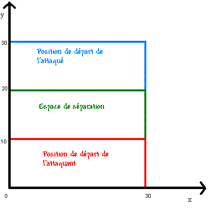

# 5. Combats

Un combat est la confrontation armée directe entre deux entités qui se résout automatiquement au cours de la phase militaire du tour.

Chaque affrontement se découpe en tours de combat successifs, régis par le capital de combativité des unités, jusqu'à la destruction, la fuite ou l'épuisement de l'un des belligérants.

Un combat est soit spatial, soit planétaire. Sa résolution comporte toujours une part d'aléatoire.

À l'issue d'un combat opposant une flotte à une ou plusieurs planètes, cette flotte adopte automatiquement la directive *Attitude neutre*.

Lors d'un affrontement particulièrement meurtrier, le parsec où il a eu lieu peut de venir dangereux en raison de l'accumulation de débris de vaisseaux.

Il existe des technologies permettant d'éliminer les débris, telles que le dragueur de mines.

## 5.1 Durée d’un combat

La durée d’un combat correspond au nombre de tours de combat successifs nécessaires à sa résolution au cours de la phase militaire.

Elle est directement déterminée par le capital de combativité des vaisseaux engagés.

Au début de chaque combat, la combativité de chaque vaisseau composant les flottes engagées est calculée.

La combativité est égale à : 5 + caractéristique Moral du héro + niveau de moral de l'équipage.

Voici les différents niveau de moral d'un équipage :

|     |                |
|-----|----------------|
| 0   | Suicidaire     |
| 1   | Défaitiste     |
| 2   | Calamiteux     |
| 3   | Mauvais        |
| 4   | Médiocre       |
| 5   | Moyen          |
| 6   | Assez bon      |
| 7   | Bon            |
| 8   | Très bon       |
| 9   | Excellent      |
| 10  | Extraordinaire |
| 11  | Suprême        |

La combativité représente le nombre de tours de combat durant lesquels un vaisseau est capable de faire feu. À chaque fin de tour, tous les vaisseaux perdent 1 point de combativité. Dès qu'un appareil tombe à 0 point de combativité, il de vient incapable de tirer et tente de prendre la fuite.

## 5.2 Combat spatial

Un combat spatial oppose deux flottes et s'appuie sur la puissance de combat spatial de vos vaisseaux.

Le combat prend fin lorsque :

- tous les vaisseaux atteignent 0 point de combativité ;

- l'une des deux flottes est entièrement détruite.

### 5.2.1 L’espace de combat

Le combat entre deux flottes se résout dans un espace à 3 dimensions. Les positions de départ des vaisseaux des deux flottes sont indiquées par le plan de coupe suivant :

Les vaisseaux de chaque flotte sont donc placés par défaut de manière aléatoire dans leurs camps respectifs (la coordonnée de la troisième dimension étant fixée à 0). Ensuite, la position de chaque vaisseau varie d'une valeur aléatoire comprise entre -5 et 5 sur les axes x et y, et entre -10 et 10 sur le troisième axe (z).

Une même case peut accueillir un nombre illimité de vaisseaux.

### 5.2.2 Cibles

Pour chaque vaisseau, une liste de cibles potentielles est établie de manière aléatoire ou définie par une stratégie de combat (voir [5.4 Stratégies de combat](#5.4)). Parmi celles-ci, l'appareil prend pour cible définitive le vaisseau le plus proche.

### 5.2.3 Tempo

Un tempo d’action est attribué à chaque vaisseau en combinant plusieurs paramètres : la caractéristique Vitesse du héro éventuellement présent, le niveau d'expérience de l'équipage, la vitesse de déplacement du vaisseau et la vitesse moyenne de son armement. Une grande part d'aléatoire vient moduler le résultat final.

### 5.2.4 Mouvement

Chaque vaisseau se dirige vers la position de sa cible avec un mouvement égal à sa capacité de vitesse. L'ordre des mouvements se fait du tempo le plus petit au plus grand.

*Exemple : Un intercepteur a un tempo de 2345 et combat contre une frégate de tempo 1367. La frégate bouge avant l'intercepteur.*

Les vaisseaux peuvent tenter de fuir si :

- La stratégie de combat le prévoit (via agressivité et cible prioritaire)

- Le vaisseau ne possède pas d’armes, ou ses armes ont été détruites.

- Sa combativité est égale à 0.

Lorsqu’un vaisseau prend la fuite, il manœuvre pour rejoindre la zone de la grille tactique la plus distante de la flotte ennemie. La fuite ne met pas fin au combat.

### 5.2.5 Tir

Chaque vaisseau tire sur sa cible. L'ordre des tirs se déroule du tempo le plus grand au plus petit.

*Exemple : Un intercepteur a un tempo de 2345 et combat contre une frégate de tempo 1367. L’intercepteur tire avant la frégate.*

Une ou plusieurs cibles sont désignées. Le nombre de cibles maximum d’un vaisseau est défini par sa taille selon le tableau suivant :

|        |                  |
|--------|------------------|
| Taille | Nombre de cibles |
| 1      | 1                |
| 2      | 4                |
| 3      | 8                |
| 4      | 16               |
| 5      | 32               |
| 6      | 64               |
| 7      | 128              |
| 8      | 256              |
| 9      | 512              |
| 10     | 2000             |

Chaque arme du vaisseau tire l'une après l'autre. Les armes les plus rapides tirent d'abord. Lorsque toutes les cibles sont détruites, le vaisseau ne tire plus. Les armes ne tirent qu’une seule fois par tour de combat. Si la cible est hors de portée de l’arme, elles ne tirent pas. Une séquence de tir se déroule dans cet ordre :

- Chances de l'arme de toucher les vaisseaux de la taille de la cible ;

- Distance entre le vaisseau et sa cible (plus elle est faible, plus les chances sont importantes) ;

- Caractéristique Attaque du héro attaquant ;

- Caractéristique Défense du héro défenseur ;

- Niveau d'expérience des équipages des deux vaisseaux ;

- Fiabilité de l'arme : l'arme a un pourcentage de chance égal à sa caractéristique *fiabilité* de ne pas fonctionner correctement.

- Si la cible est touchée, des dégâts spécifiés dans la description de l'arme utilisée lui sont infligés.

- Si la cible possède des boucliers en état de marche, ceux-ci absorbent les dégâts provoqués par l'arme qui sont égaux à sa caractéristique *dommages bouclier*. Si la cible ne possède pas de boucliers, ou si ces boucliers ne peuvent plus absorber de dommages, les dégâts sont infligés au vaisseau en nombre égal à la caractéristique de l'arme *dommages coque*.

- Les dégâts sont infligés à un composant du vaisseau tiré au hasard. Si un composant du vaisseau est détruit, c'est-à-dire si les points de dommages infligés sont supérieurs au nombre de cases qu'il occupe, ce composant est détruit et inutilisable.

*Exemple : L'intercepteur endommage la frégate. Un des lasers de cette frégate est détruit. Ce laser ne pourra plus tirer lors de ce combat et des suivants jusqu’à réparation.*

Chaque bouclier permet de parer un certain nombre de points de dégâts (le bouclier de type I permet de parer 2 points de dégâts). Une fois que ces dommages sont encaissés, les boucliers deviennent inactifs et le vaisseau prend des dommages de coques. A la fin du tour de jeu (pas la fin du tour de combat), les boucliers seront rechargés.

Si le moteur du vaisseau est détruit, il y a 1% de chance qu’il explose. Si le vaisseau n’explose pas, il ne bouge plus pour le reste du combat. Il pourra cependant toujours se déplacer dans la galaxie (pour éventuellement rejoindre un système avec un chantier naval pour réparation).

### 5.2.6 Choix des cibles suivantes et tirs suivants

Les armes qui n'ont pas encore tiré désignent de nouvelles cibles.

*Exemple : Un intercepteur standard (taille 1) ne peut viser qu'une seule cible par tour. Une frégate standard (taille 4) peut tirer sur 16 vaisseaux différents par tour.*

## 5.3 Combat planétaire

Un combat planétaire se déroule exclusivement entre une flotte et une planète. C’est la puissance de combat planétaire de vos vaisseaux qui est prise en compte lors de l'affrontement.

Sur la planète ciblée, les bâtiments ainsi que la milice subissent les dégâts.

Un combat entre une flotte et un système consiste en une succession d’assauts contre ses planètes. Lorsqu’une planète est vaincue, l'affrontement se poursuit sur la suivante au sein d'un seul et même combat. Il est à noter que l'exigence minimale de puissance d'une flotte pour permettre un combat planétaire n'est pas réévaluée à chaque nouvelles planètes. L'ordre des planètes attaquées est déterminé de manière aléatoire.

Le combat prend fin lorsque :

- Toutes les planètes sont vaincues ;

- La flotte est détruite ;

- Tous les vaisseaux de la flotte ont 0 point de combativité;

- La flotte a une puissance inférieure à 50.

Un vaisseau attaque une planète soit depuis la stratosphère, soit à la surface, selon son niveau d’agressivité. En début de partie, l’agressivité est réglée sur « standard » : seuls les vaisseaux dépourvus de bombes mènent leur assaut au sol, tandis que les autres bombardent depuis la stratosphère. Par la suite, il est possible de modifier ce comportement via des stratégies de combat. (Voir [5.4 Stratégies de combat](#5.4))

|                     |                                                                                                                      |
|---------------------|----------------------------------------------------------------------------------------------------------------------|
| Fuyard ou Prudent   | Tous les vaisseaux attaquent en mode stratosphérique : seules les bombes sont efficaces                              |
| Standard ou Pillage | Seuls les vaisseaux ne possédant pas de bombe attaquent à la surface. Les autres attaquent en mode stratosphérique   |
| Combatif            | Seuls les vaisseaux ne possédant que des bombes attaquent en mode stratosphérique. Les autres attaquent à la surface |
| Rageur              | Tous les vaisseaux attaquent à la surface                                                                            |

### 5.3.1 Attaque stratosphérique

Les vaisseaux équipés de bombes peuvent mener une attaque stratosphérique. Dans ce cas, ils emploient exclusivement leurs bombes. Seules les batteries de défense planétaires peuvent riposter ; la milice ne peut pas attaquer.

L’attaque stratosphérique manquant de précision, les bâtiments planétaires doivent être totalement détruits avant que des dégâts ne puissent être infligés à la milice. Il faut obligatoirement un tour de combat complet pour achever la destruction des bâtiments, même si les dégâts infligés excèdent largement le montant nécessaire. Les dégâts excédentaires ne sont donc pas reportés sur la milice ; ce n’est qu’au tour de combat suivant que cette dernière subira les assauts.

### 5.3.2 Attaque à la surface

Tous les vaisseaux peuvent mener une attaque à la surface d’une planète. Dans ce cas, ils emploient l’ensemble de leurs armes. Les batteries de défense et la milice peuvent alors les attaquer en retour. Les vaisseaux ciblent en priorité la milice et épargnent les bâtiments planétaires : ils ne leur infligent donc aucun dégât, exception faite des boucliers planétaires.

### 5.3.3 Résolution du combat

Durant un combat planétaire, les vaisseaux ne disposent d'aucune phase de mouvement : l'affrontement consiste en une succession directe d'échanges de tirs.

L'ordre des tirs est le suivant :

1.  Les batteries de défense planétaires tirent prioritairement sur les forces stratosphériques.

2.  Les forces stratosphériques tirent.

3.  La milice tire.

4.  Les vaisseaux qui attaquent à la surface tirent.

### 5.3.4 Puissance de la milice et des batteries

La milice correspond à la part de la population chargée de défendre la planète en cas d'attaque ; la stabilité de celle-ci détermine le nombre de miliciens mobilisés.

À 100 % de stabilité, la totalité de la population se mobilise sous forme de miliciens. En revanche, avec une stabilité de 80 %, seuls 80 % des habitants rejoindront la milice. Les 20 % restants ne combattront pas et seront capturés par votre adversaire s’il parvient à s'emparer de la planète.

En outre, si la planète est en révolte, son coefficient de défense est à nouveau divisé par 2.

Chaque groupe de 10 (millions) miliciens est armé d'un laser de type I. Ils tirent à la portée maximale de l'arme. Ils ont donc relativement peu de chance de toucher.

Une batterie de défenses correspond à 50 armes du type et du niveau du bâtiment. Par exemple, une batterie plasma de type III représente l'équivalent de 50 canons à plasma de type III. On considère qu'elles tirent à une portée de 0, elles ont donc de grandes chances de toucher. Les constructions planétaires sont détruites quand elles ont subi un nombre de points de dommage supérieur ou égal à leurs points de structure.

Le pourcentage de chance de toucher les bâtiments ou la milice par un vaisseau est déterminé sur une base de 50%. On applique ensuite les modificateurs identiques à ceux du combat spatial.

Les boucliers planétaires permettent d'encaisser un certain nombre de dégâts. Ni la milice, ni les autres constructions ne peuvent subir de dégât tant que le bouclier est actif. 

Si le bouclier planétaire n'est pas détruit à la fin du combat, il se recharge complètement à la fin du tour de jeu.

**Il faut obligatoirement un tour de combat complet pour achever la destruction du bouclier planétaire, même si les dégâts infligés excèdent largement le montant nécessaire. Les dégâts excédentaires ne sont donc pas reportés aux autres bâtiments, ni la milice le cas échéant ; ce n'est qu'au tout de combat suivant que ces derniers subiront les assauts.**

## 5.4 Stratégies de combat

Une stratégie de combat est un ensemble de paramètres tactiques prédéfinis qu'un commandant peut assigner à une flotte via la console d'ordre de déplacement, en prévision d’un éventuel affrontement.

Sa création requiert la découverte préalable de la technologie *Maîtrise du combat*.

Dans le cadre d’un combat planétaire, la stratégie de combat sert exclusivement à déterminer le niveau d’agressivité de la flotte. Les autres paramètres ne seront utiles que si la flotte est entraînée dans un combat spatial.

Une stratégie comporte plusieurs paramètres :

- Un type de cible prioritaire : bombardiers, chasseurs ou aucun en particulier

*Exemple : Dans la stratégie "Essai", les bombardiers sont spécifiés comme cible prioritaire. Les vaisseaux de la flotte utilisant cette stratégie attaqueront donc d'abord les vaisseaux possédant des bombes. S’il n'y a pas ou plus de bombardiers dans la flotte adverse, ils passeront à l'attaque des autres types de vaisseaux (à moins que l'agressivité ne dicte autrement).*

- Un paramètre de positionnement par type de vaisseau. Si un positionnement pour un type de vaisseau donné n'est pas spécifié, ce positionnement se fait au hasard. Pour la stratégie par défaut, aucun type de vaisseau n'a son positionnement spécifié.

*Exemple : Dans la stratégie « Essai », les intercepteurs standards sont positionnés en (17, 3). Tous les intercepteurs standards d'une flotte attaquante utilisant cette stratégie seront donc déployés en (17, 3). Une part d'aléa sera ensuite appliquée à chacun d'eux afin d'ajuster leur position définitive. Si cette même flotte subit une attaque, ses intercepteurs seront automatiquement repositionnés en (13, 27), soit (30 - 17, 30 - 3) : lors de l'élaboration d'une stratégie, la flotte is toujours considérée comme l'attaquante ; le système adapte automatiquement les coordonnées si elle se retrouve en position de défense. *

- Un paramètre de taille de cibles prioritaires. Il est possible de spécifier les tailles de vaisseaux prioritaires à attaquer. Si aucune taille de cible prioritaire n'est définie, les vaisseaux commencent par attaquer automatiquement les vaisseaux les plus grands. La stratégie par défaut ne définit aucune taille prioritaire. La taille des cibles intervient comme deuxième critère, après que le type de cible prioritaire a été défini.

*Exemple : Dans la stratégie "Essai", les intercepteurs standards doivent attaquer les cibles de taille, dans l’ordre : 5 3 4 1 2 6 8 7 9 10. Ils chercheront donc à attaquer les bombardiers de taille 5. S’il n'y en a pas ou plus, ils passeront aux bombardiers de taille 3, etc. S’il n'y plus de bombardiers adverses, ils attaqueront les vaisseaux de taille 5, puis ceux de taille 3, etc.*

- Un paramètre d'agressivité. 6 types d'agressivité peuvent être choisis :

|          |                                                                                                                      |                                                                                                             |
|----------|----------------------------------------------------------------------------------------------------------------------|-------------------------------------------------------------------------------------------------------------|
| Fuyard   | Tous les vaisseaux attaquent en mode stratosphérique : seules les bombes sont efficaces                              | Les vaisseaux de la flotte tentent de fuir dès l'engagement d’un combat spatial                             |
| Prudent  | Tous les vaisseaux attaquent en mode stratosphérique : seules les bombes sont efficaces                              | Les vaisseaux de la flotte tentent de fuir si la puissance de la flotte adverse est deux fois plus grande   |
| Standard | Seuls les vaisseaux ne possédant pas de bombe attaquent à la surface. Les autres attaquent en mode stratosphérique   | Les vaisseaux de la flotte tentent de fuir si la puissance de la flotte adverse est quatre fois plus grande |
| Pillage  | Seuls les vaisseaux ne possédant pas de bombe attaquent à la surface. Les autres attaquent en mode stratosphérique   | Les vaisseaux de la flotte tentent de fuir s’il n'y a plus de vaisseaux du type visé.                       |
| Combatif | Seuls les vaisseaux ne possédant que des bombes attaquent en mode stratosphérique. Les autres attaquent à la surface | Les vaisseaux de la flotte tentent de fuir si la puissance de la flotte adverse est huit fois plus grande.  |
| Rageur   | Tous les vaisseaux attaquent à la surface                                                                            | Les vaisseaux ne tentent jamais de fuir à cause de la puissance de la flotte adverse.                       |

*Exemple : Dans la stratégie "Essai", l'agressivité est en mode Pillage. Si la flotte adverse ne comporte plus de bombardiers, les vaisseaux tenteront automatiquement de fuir. La stratégie par défaut est en mode d'agressivité standard.*

## 5.5 Dommages et réparations

Un vaisseau est la somme de ses composants, dont chacun occupe un certain nombre de cases (voir [3.5](3_constructions.md#3.5)).

Chaque composant de vaisseau détruit le reste jusqu'à ce qu'il soit réparé. Un composant détruit ne fonctionne plus.

Un chantier naval permet de construire des vaisseaux, mais aussi de les réparer à hauteur de 20 points de dommages (1 dommage subi = 1 case de composant endommagée).

Attention : un chantier ne répare qu’une seule flotte par tour. Si vous avez plusieurs vaisseaux endommagés répartis dans différentes flottes, il convient donc de les fusionner.

Le système où se situe le chantier doit appartenir au propriétaire de la flotte ou à l’un de ses alliés. Chaque point de dégât réparé coûte 0,5 centaure. Si le propriétaire du système dispose d'assez de centaures, la flotte est automatiquement réparée.

A chaque fin de tour, chaque construction planétaire est réparée de 5 points. Les boucliers planétaires sont complètement réparés en un tour.

Il existe également des centres de réparation spatiale, déblocables par la recherche technologique, qui augmentent le seuil des points de dommages réparables.
