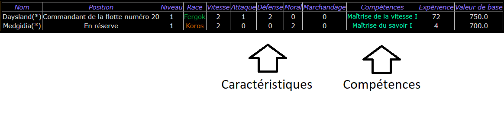

# 8. Lieutenants

## 8.1 Généralités

Un lieutenant est un officier recruté pour apporter des bonus opérationnels dans une flotte ou sur un système.

Chaque lieutenant dispose de caractéristiques et de compétences propres, par exemple :

On distingue deux catégories de lieutenants :

- Les héros, qui dirigent les flottes.

- Les gouverneurs, qui administrent et défendent les systèmes.

À chaque tour, dix héros et dix gouverneurs sont mis aux enchères.

Chaque commandant peut y participer, **dans la limite d'une seule offre par tour**.

L'enchère minimale équivaut à la valeur de base du lieutenant convoité. Le meilleur enchérisseur s'assure ses services jusqu'à sa mort.

L’offre d’un commandant sans aucun lieutenant compte double.

Le coût d'entretien par tour d'un lieutenant s'élève à 10 % de sa valeur de base.

## 8.2 Caractéristiques

Les lieutenants possèdent cinq caractéristiques, dont l'utilité varie parfois selon qu'il s'agit d'un héro ou d'un gouverneur.

|             |                                                             |                                                               |
|-------------|-------------------------------------------------------------|---------------------------------------------------------------|
| Vitesse     | Améliore le tempo des vaisseaux                             | Augmente d’autant les points de construction du système       |
| Attaque     | Améliore le tir de vos vaisseaux                            | Améliore le tir des batteries de défense planétaire.          |
| Défense     | Réduit les chances d’être touché par les vaisseaux adverses | Réduit les chances d’être touché par les vaisseaux adverses   |
| Moral       | Améliore la combativité des vaisseaux                       | Donne au système un bonus en stabilité égal à la statistique. |
| Marchandage | Pas d’intérêt dans cette version du jeu.                    | Pas d’intérêt dans cette version du jeu.                      |

## 8.3 Compétences

Lors de son recrutement, un lieutenant a une compétence de niveau I. Chaque compétence a 5 niveaux. D’autres compétences peuvent apparaître lors des passages de niveaux des lieutenants.

|                         |                                                                                                                              |                                                                                                                                                                                                          |
|-------------------------|------------------------------------------------------------------------------------------------------------------------------|----------------------------------------------------------------------------------------------------------------------------------------------------------------------------------------------------------|
| Maîtrise de la vitesse  | Augmente de 50% par niveau la caractéristique vitesse                                                                        | Augmente de 50% par niveau la caractéristique vitesse                                                                                                                                                    |
| Maîtrise de l’attaque   | Augmente de 50% par niveau la caractéristique d’attaque                                                                      | Augmente de 50% par niveau la caractéristique d’attaque                                                                                                                                                  |
| Maîtrise de la défense  | Augmente de 50% par niveau la caractéristique de défense                                                                     | Augmente de 50% par niveau la caractéristique de défense                                                                                                                                                 |
| Maîtrise du moral       | Augmente de 50% par niveau la caractéristique de moral                                                                       | Augmente de 50% par niveau la caractéristique de moral                                                                                                                                                   |
| Maîtrise du marchandage | Augmente de 50% par niveau la caractéristique de marchandage                                                                 | Augmente de 50% par niveau la caractéristique de marchandage                                                                                                                                             |
| Inspiration Fanatique   | Galvanise lors d’un combat les vaisseaux ayant un équipage de même espèce que lui.                                           | Galvanise lors d’un combat les défenseurs du système quelle que soit leur espèce.                                                                                                                        |
| Entretien de la flotte  | Diminue de 20% par niveau le coût de l'entretien de la flotte                                                                | Non concerné                                                                                                                                                                                             |
| Entretien du lieutenant | Diminue de 20% par niveau le coût de l'entretien du lieutenant                                                               | Diminue de 20% par niveau le coût de l'entretien du lieutenant                                                                                                                                           |
| Immortalité             | Lorsqu’il est tué, Il y a niveau x 20% de chance que le héro ne meure pas et rejoigne la réserve de son commandant.          | Lorsqu’il est tué, Il y a niveau x 20% de chance que le héro ne meure pas et rejoigne la réserve de son commandant.                                                                                      |
| Voyageur                | Augmente d’une case par niveau la vitesse de la flotte qu'il commande                                                        | Non concerné                                                                                                                                                                                             |
| Maîtrise du savoir      | Gagne 20% de points d'expérience en plus par niveau. Permet également aux vaisseaux de mieux se positionner lors d'un combat | Gagne 20% de points d'expérience en plus par niveau.                                                                                                                                                     |
| Entretien du système    | Non concerné                                                                                                                 | Diminue de 20% par niveau le coût de l'entretien des constructions planétaires du système. Multiplie également les points de dommages réparés automatiquement des bâtiments par le niveau de compétence. |
| Maîtrise de la finance  | Non concerné                                                                                                                 | Augmente de 20% par niveau le revenu du système                                                                                                                                                          |

## 8.4 Progression

Un lieutenant gagne des points d'expérience lors des combats ou lorsqu'il administre un système qui achève des constructions. Chaque palier de 1000 points d'expérience lui permet de franchir un niveau.

À chaque passage de niveau, une de ses caractéristiques augmente aléatoirement d'un point (les caractéristiques augmentent également selon ses compétences), à l'exception du Marchandage, sans utilité dans cette version du jeu.

|             |             |             |           |                 |
|-------------|-------------|-------------|-----------|-----------------|
| **Vitesse** | **Attaque** | **Défense** | **Moral** | **Marchandage** |
| 25 %        | 25 %        | 25 %        | 25 %      | 0 %             |

De plus, il gagne un niveau dans une compétence existante ou débloque une nouvelle compétence (de niveau I). Cette attribution est aléatoire.

## 8.5 Mort

Lorsqu'une flotte commandée par un héro est détruite ou que toutes les planètes du système administré par un gouverneur sont conquises, le lieutenant concerné est considéré comme mort et est cloné, sauf s'il possède la compétence Immortalité.

En cas de mort, un clone du lieutenant — réinitialisé à zéro point d'expérience avec ses caractéristiques et ses compétences de base — apparaît au tour suivant et devient disponible aux enchères.

Seuls le héro et le gouverneur de départ de chaque commandant échappent au clonage : leur mort est définitive.
